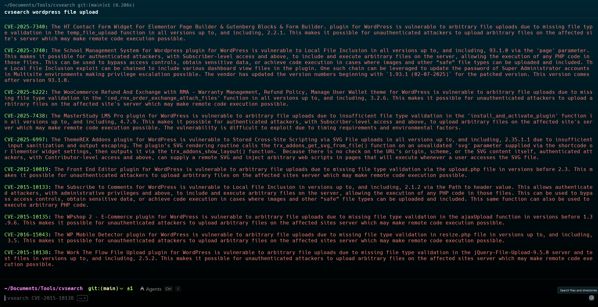

# CVE Search Tool

([Web Version](https://cve-searchtool.vercel.app))



A comprehensive tool for searching and analyzing Common Vulnerabilities and Exposures (CVEs) from the National Vulnerability Database (NVD), Shodan API, and MITRE. Available both as a command-line interface (CLI) and a web interface.

## Features

-   **Dual Interface**: CLI for terminal users and a responsive Web UI.
-   **Search Capabilities**:
    -   Search by CVE ID (e.g., `CVE-2021-44228`).
    -   Search by keywords (e.g., `wordpress`, `apache`).
-   **Detailed Vulnerability Info**:
    -   CVSS Scores (v2, v3) and Severity.
    -   EPSS (Exploit Prediction Scoring System) metrics.
    -   Known Exploited Vulnerabilities (KEV) status.
    -   Attack Vector, Complexity, and Privileges Required.
-   **External References**: Direct links to Exploit-DB, Medium, OffSec Blog, and CyberHub.
-   **API Documentation**: Swagger UI included in the web version.

## Installation

### CLI Version

1.  Clone the repository:
    ```bash
    git clone https://github.com/diogolourencodev/cvsearch
    cd cvsearch
    ```

2.  Run the installation script:
    ```bash
    chmod +x install.sh
    ./install.sh
    ```
    *Note: The script requires `sudo` privileges to move the binary to `/usr/local/bin`.*

### Web Version

1.  Navigate to the project root.

2.  Install the required Python packages (including Flask):
    ```bash
    pip install flask flasgger requests
    ```

3.  Navigate to the `web` directory:
    ```bash
    cd web
    ```

4.  Start the Flask server:
    ```bash
    python app.py
    ```

5.  Access the application in your browser at `http://127.0.0.1:5000`.

## Usage

### CLI Usage

**Search by Keyword:**
```bash
cvsearch <keyword>
# Example:
cvsearch wordpress
```

**Search by CVE ID:**
```bash
cvsearch <CVE-ID>
# Example:
cvsearch CVE-2017-0144
```

### Web Usage

```[CVE SearchTool](https://cve-searchtool.vercel.app/)```

1.  Enter a CVE ID or a keyword in the search bar.
2.  View detailed results including severity, summary, and exploit links.
3.  Access API documentation at `/apidocs` (e.g., `http://127.0.0.1:5000/apidocs/`).

## API Endpoints (Web Version)

-   `GET /api/search/<searchTerm>`: Search for a CVE ID or keyword. Returns JSON data.

## Technologies Used

-   **CLI**: Python 3, `requests`, `colorama`.
-   **Web**: Python (Flask), HTML5, CSS3, JavaScript, `flasgger`.
-   **APIs**: NVD, Shodan, MITRE.

## Author

Created by Diogo S. Lourenço
