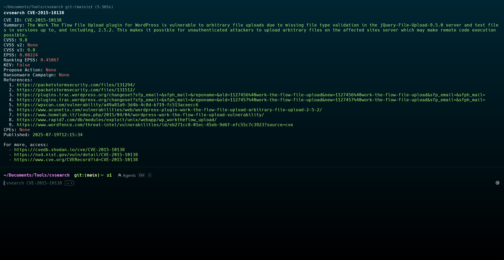

# CVE Search Tool([Web Version](https://cve-searchtool.vercel.app))


A comprehensive tool for searching and analyzing Common Vulnerabilities and Exposures (CVEs) from the National Vulnerability Database (NVD) and Shodan API. Available both as a command-line interface (CLI) and web interface.

## Features

- Search CVEs by keywords or specific CVE ID
- Detailed vulnerability information including:
  - CVSS scores (v2 and v3)
  - EPSS (Exploit Prediction Scoring System) metrics
  - Known Exploited Vulnerabilities (KEV) status
  - Affected versions and products
  - References and related links
- Risk assessment with color-coded severity levels
- Both CLI and web interface options

## Installation

### CLI Version

```bash
git clone https://github.com/diogolourencodev/cvsearch
cd cvsearch
sudo chmod +x install.sh
./install.sh
```

### Web Version

The web version runs directly in your browser - no installation needed. [Access it here](https://cve-searchtool.vercel.app) (or host the HTML file locally).

## Usage

### CLI Version

Search by keywords:
```bash
cvsearch wordpress file upload
```

Get detailed information about a specific CVE:
```bash
cvsearch CVE-2015-10138
```

### Web Version



Simply enter a CVE ID or keywords in the search box. The web version provides:
- Interactive risk assessment visualization
- Clickable references
- Direct links to official CVE databases
- Responsive design for all devices

## Demo Videos

- CLI Version: [Watch CLI Demo](https://github.com/user-attachments/assets/c5ae37c2-a14d-40b0-b0c8-312a12dd941b)
- Web Version: https://cve-searchtool.vercel.app

## Technical Details

### Data Sources
- NVD API (https://services.nvd.nist.gov)
- Shodan CVE Database (https://cvedb.shodan.io)
- CVE Program (https://www.cve.org)
- OffSec blog (https://www.offsec.com/)
- Cyber Hub (https://www.cyberhub.blog/)

### Technologies Used
- **CLI**: Python 3 with requests and colorama libraries
- **Web**: HTML5, CSS3, JavaScript with responsive design

## Risk Assessment Methodology

The tool evaluates vulnerabilities based on:
- CVSS scores (v3 preferred)
- EPSS probability scores
- Known Exploited Vulnerabilities catalog
- Ransomware campaign involvement

Risk levels are color-coded:
- 🔴 **CRITICAL**: CVSS ≥ 9.0 and EPSS ≥ 75% or in KEV
- 🟠 **HIGH**: CVSS ≥ 7.0 and EPSS ≥ 50%
- 🟡 **MODERATE**: CVSS ≥ 7.0
- 🟢 **LOW**: All others

## Author

Created by Diogo S. Lourenço
